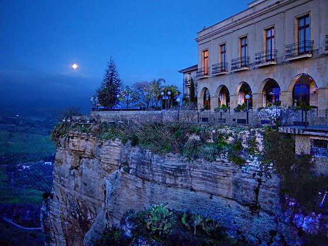

# Low-light-Image-Enhancement
Python implementation of two low-light image enhancement techniques via illumination map estimation, based on the following papers:
 * Dual Illumination Estimation for Robust Exposure Correction [[link](https://arxiv.org/pdf/1910.13688.pdf)]
 * LIME: Low-light Image Enhancement via Illumination Map Estimation [[link](https://ieeexplore.ieee.org/document/7782813)]

Both methods are based on retinex modelling, and aim at estimating the illumination map by preserving the prominent structure of the image, while removing the redundant texture details. To do this, the same optimization formulation is used by both papers (see references). The novelty introduced by the first paper (called DUAL below) compared to the second (called LIME below) is the estimation of this map for the original image, and for its inverted version, which allows to correct both the under-exposed and over-exposed parts of the image.

The code implemented in this repository allows the use of both methods, which can be easily selected from the script parameters.

## Installation
This implementation runs on python >= 3.7, use pip to install dependencies:
```
pip3 install -r requirements.txt
```

## Usage
Use the `demo.py` script to enhance your images.
```
usage: demo.py [-h] [-f FOLDER] [-g GAMMA] [-l LAMBDA_] [-ul] [-s SIGMA]
               [-bc BC] [-bs BS] [-be BE] [-eps EPS]

Python implementation of two low-light image enhancement techniques via illumination map estimation.

optional arguments:
  -h, --help            show this help message and exit
  -f FOLDER, --folder FOLDER
                        folder path to test images.
  -g GAMMA, --gamma GAMMA
                        the gamma correction parameter.
  -l LAMBDA_, --lambda_ LAMBDA_
                        the weight for balancing the two terms in the illumination refinement optimization objective.
  -ul, --lime           Use the LIME method. By default, the DUAL method is used.
  -s SIGMA, --sigma SIGMA
                        Spatial standard deviation for spatial affinity based Gaussian weights.
  -bc BC                parameter for controlling the influence of Mertens's contrast measure.
  -bs BS                parameter for controlling the influence of Mertens's saturation measure.
  -be BE                parameter for controlling the influence of Mertens's well exposedness measure.
  -eps EPS              constant to avoid computation instability.
```

### Example
```
python3 demo.py -f ./demo/ -l 0.15 -g 0.6
```

### Result
Low Light Image             |  Enhanced Image
:-------------------------:|:-------------------------:
  |  

### TODO
 - [ ] Add a fourier based solver to speed up the inference
 
 
### :mortar_board: Citation
If you find this work useful in your research, please consider citing:
```
@misc{lowlightpython,
  author = {Souhaib Attaiki},
  title = {Low light Image Enhancement},
  year = {2020},
  publisher = {GitHub},
  journal = {GitHub repository},
  howpublished = {\url{https://github.com/pvnieo/Low-light-Image-Enhancement}},
}

```
